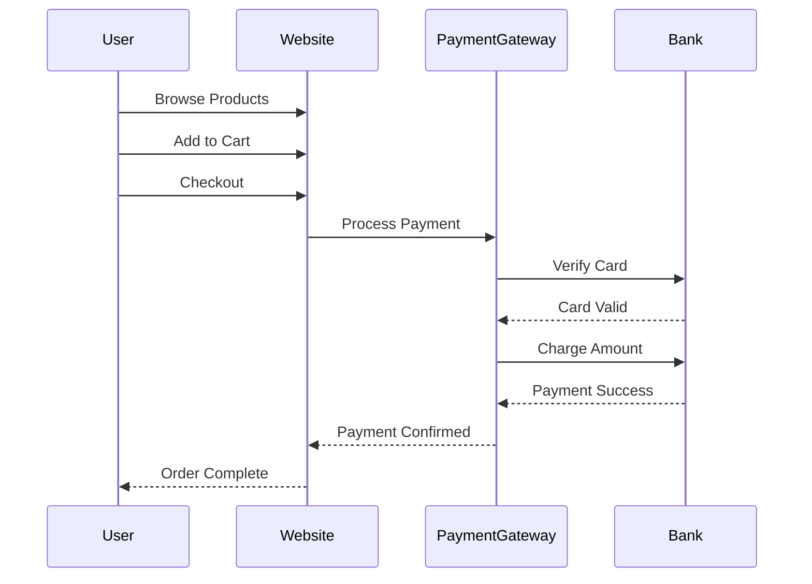

# 截图指南 / Screenshots Guide

本文档指导您如何为 Modern Mermaid 项目创建专业的截图。

## 📸 需要的截图清单

### 1. 项目横幅 (banner.png)
**尺寸**: 1200 x 300 像素

**内容建议**:
- 项目名称 "Modern Mermaid"
- 标语：如 "Beautiful Mermaid Diagrams Made Easy"
- 简洁的渐变背景
- 可选：小型示例图表

**工具**: Figma, Canva, 或 Adobe Photoshop

---

### 2. 主界面截图 (screenshot-main.png)
**尺寸**: 1920 x 1080 像素

**拍摄内容**:
```
✅ 左侧编辑器（30%宽度）
   - 显示有语法高亮的 Mermaid 代码
   - 显示行号
   - 使用有意义的示例代码（流程图或时序图）

✅ 右侧预览（70%宽度）
   - 渲染后的图表居中显示
   - 使用美观的主题（推荐：Linear Light 或 Studio Ghibli）
   - 显示缩放控制按钮

✅ 顶部工具栏
   - 主题选择器
   - 背景选择器
   - 字体选择器
   - 标注工具
   - 复制按钮
   - 导出按钮
```

**推荐示例代码**:


---

### 3. 主题展示 (screenshot-themes.png)
**尺寸**: 1920 x 1080 像素

**拍摄方式**:
- 使用图片编辑软件创建网格布局
- 展示 4-6 个不同主题
- 每个主题显示相同的图表
- 标注每个主题的名称

**推荐展示的主题**:
1. Linear Light
2. Linear Dark
3. Hand Drawn
4. Studio Ghibli
5. Industrial
6. Retro

---

### 4. 标注工具 (screenshot-annotations.png)
**尺寸**: 1920 x 1080 像素

**拍摄内容**:
```
✅ 打开标注工具菜单
✅ 在图表上有多个标注示例：
   - 箭头指向重要节点
   - 矩形框住关键区域
   - 圆形标记特定部分
   - 文本注释说明
✅ 显示不同颜色的标注
✅ 至少 3-4 个标注在图表上
```

---

### 5. 导出选项 (screenshot-export.png)
**尺寸**: 1920 x 1080 像素

**拍摄内容**:
```
✅ 打开"导出"下拉菜单
   - "带背景 - JPG - 包含背景色"
   - "透明背景 - PNG - 透明背景"

✅ 打开"复制"下拉菜单（如果可以同时显示）
   - "复制带背景图片 - 包含当前选择的背景"
   - "复制透明背景 - PNG格式，无背景"

✅ 背景有美观的图表
```

---

## 🎨 截图最佳实践

### 浏览器设置
- 使用 Chrome 或 Firefox
- 分辨率：1920 x 1080 或更高
- 缩放比例：100%
- 隐藏浏览器书签栏
- 使用无痕模式（避免扩展干扰）

### 代码示例选择
推荐使用这些类型的图表：
- **流程图**: 展示决策流程
- **时序图**: 展示系统交互（推荐用于主截图）
- **类图**: 展示软件架构
- **状态图**: 展示状态转换

### 视觉效果
- 使用明亮清晰的主题
- 确保文字可读
- 图表不要太小也不要太大
- 保持界面整洁

### 技术要求
- **格式**: PNG（推荐，支持透明）
- **压缩**: 使用 TinyPNG 或类似工具压缩
- **命名**: 严格按照要求命名
- **位置**: 放在 `docs/images/` 目录

---

## 🛠️ 推荐工具

### 截图工具
- **macOS**: Cmd + Shift + 4（区域截图）
- **Windows**: Win + Shift + S（截图工具）
- **Linux**: Flameshot（功能强大）
- **浏览器**: Chrome DevTools（完整页面截图）

### 编辑工具
- **简单编辑**: Preview (macOS), Paint (Windows)
- **专业编辑**: Photoshop, GIMP, Figma
- **标注工具**: Snagit, Skitch

### 压缩工具
- [TinyPNG](https://tinypng.com/) - 在线压缩
- [ImageOptim](https://imageoptim.com/) - Mac 应用
- [Squoosh](https://squoosh.app/) - Google 的在线工具

---

## 📝 提交检查清单

在提交截图前，请确认：

- [ ] 所有 5 张截图都已创建
- [ ] 文件名完全正确
- [ ] 分辨率符合要求
- [ ] 图像清晰，无模糊
- [ ] 使用了有意义的示例
- [ ] 主题美观专业
- [ ] 文件已压缩（< 500KB 每张）
- [ ] 放在正确的目录 (`docs/images/`)

---

## 💡 额外建议

### 创建动图 (可选)
如果想要更生动的展示，可以创建 GIF 动图：
- 展示编辑和实时预览
- 展示主题切换
- 展示标注工具使用

**工具**: 
- [LICEcap](https://www.cockos.com/licecap/) (Windows/Mac)
- [Kap](https://getkap.co/) (Mac)
- [ScreenToGif](https://www.screentogif.com/) (Windows)

### 视频演示 (可选)
创建一个 30-60 秒的快速演示视频：
- 上传到 YouTube
- 在 README 中添加链接
- 展示主要功能

---

## 📞 需要帮助？

如果您在创建截图时遇到问题：
- 在 GitHub Issues 中提问
- 加入 Discord 社区
- 发送邮件至 support@gotoailab.com

---

**提示**: 高质量的截图能显著提升项目的专业度和吸引力，值得花时间做好！✨

